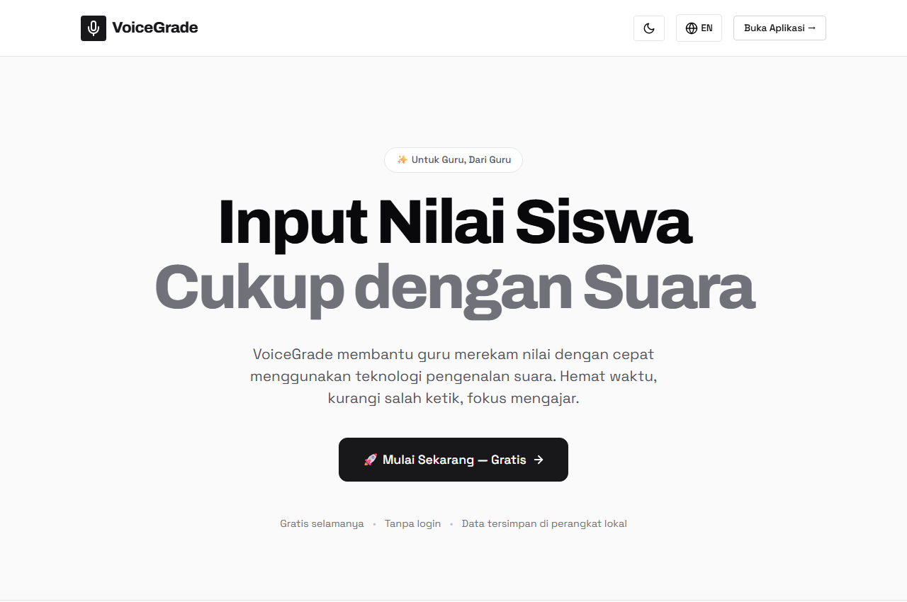
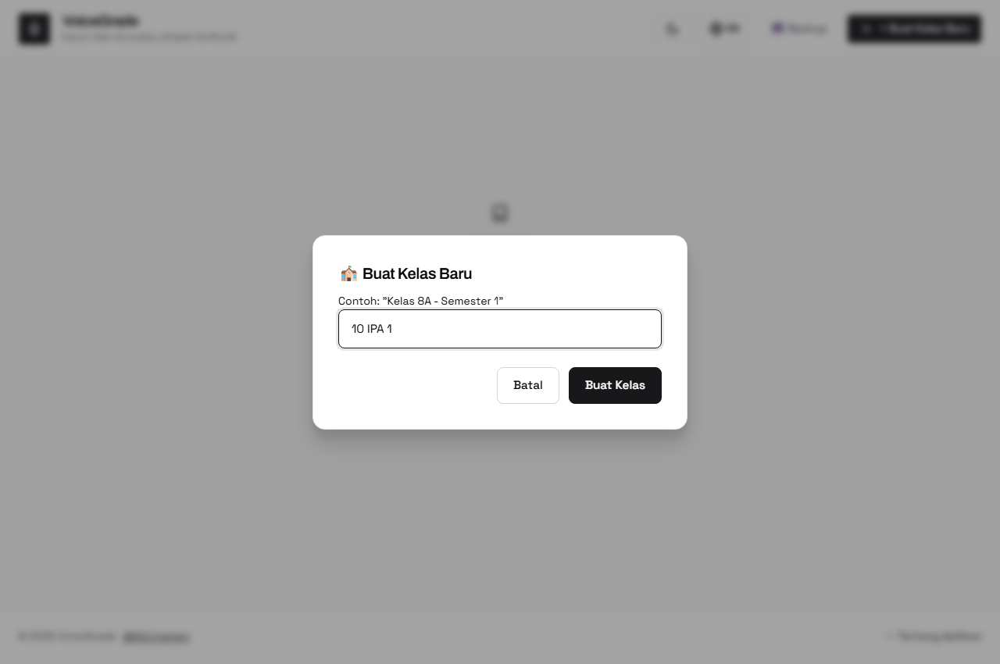
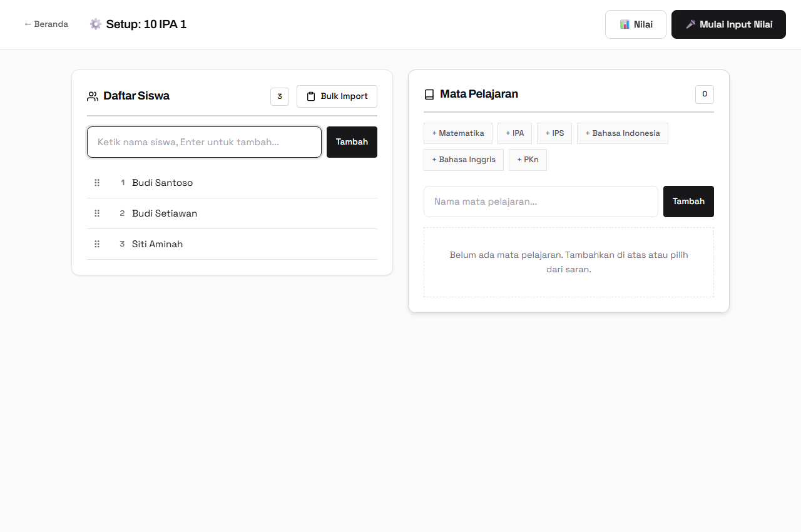
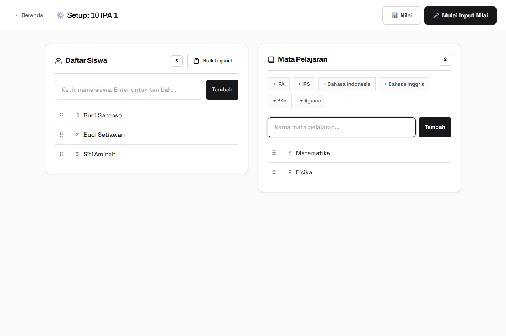
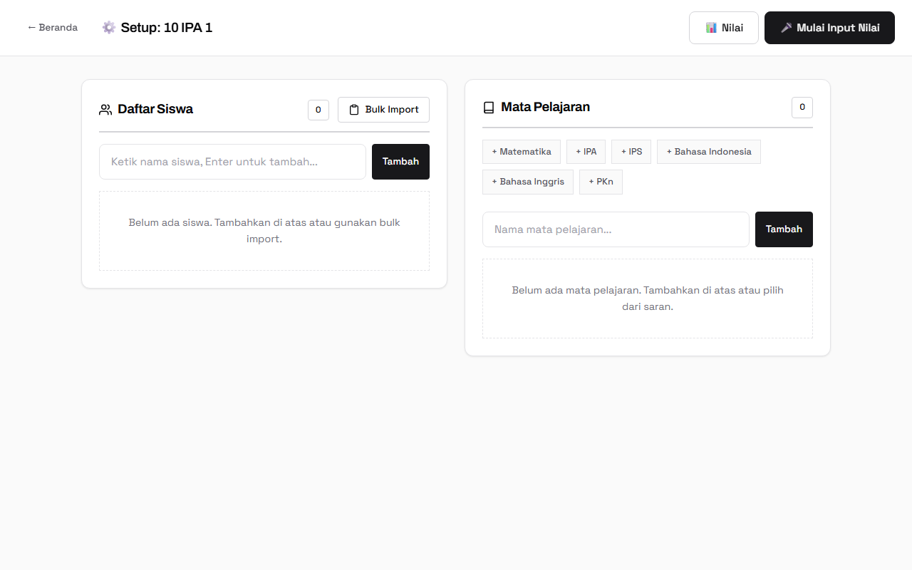
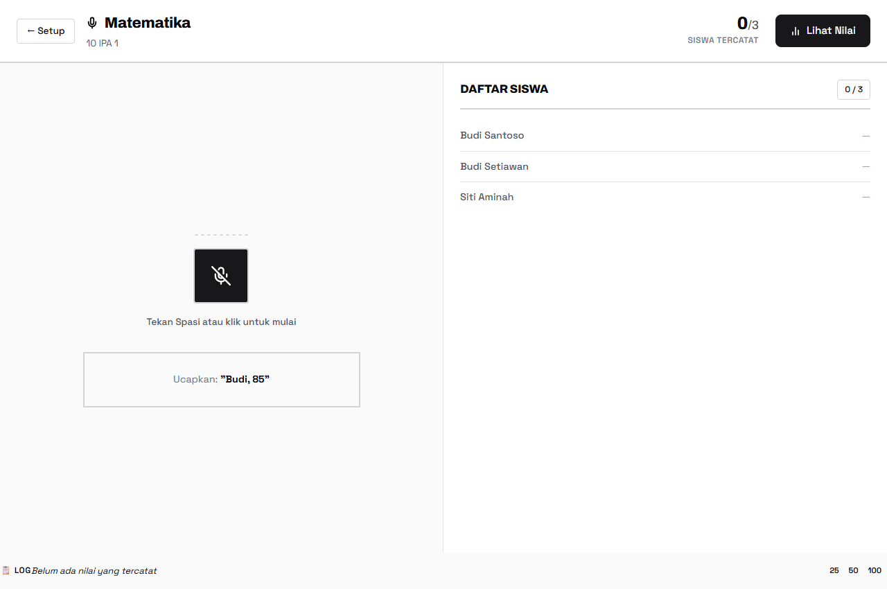
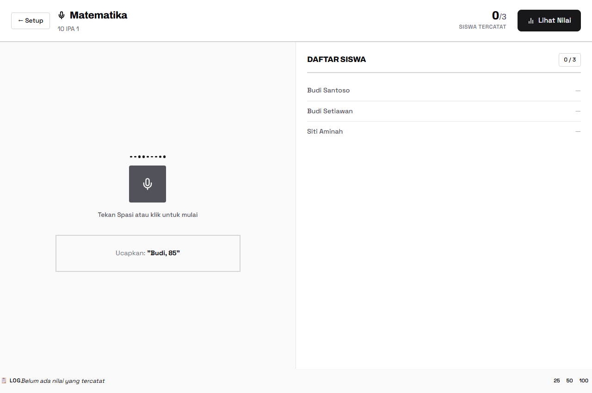
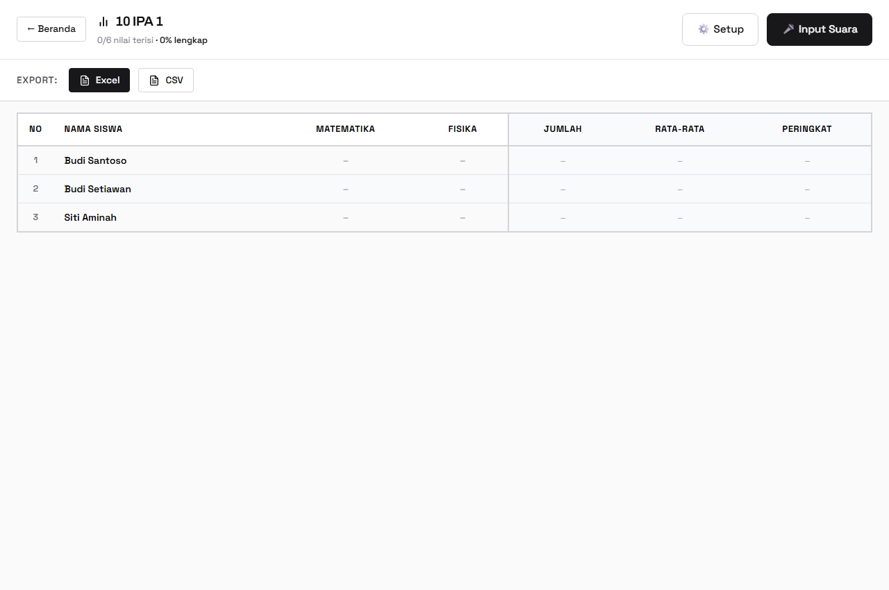
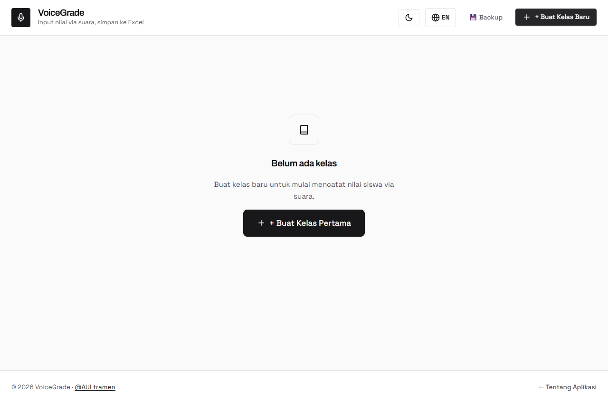

# Panduan Penggunaan Lengkap VoiceGrade

Selamat datang di panduan penggunaan **VoiceGrade**, aplikasi inovatif untuk mencatat nilai siswa menggunakan suara Anda! Panduan ini akan memandu Anda langkah demi langkah dalam menggunakan setiap fitur di VoiceGrade.

---

## 1. Pengaturan Awal: Bahasa dan Tema

Sebelum mulai, Anda dapat mengatur preferensi bahasa dan tampilan antarmuka (gelap/terang).

**Langkah-langkah:**
1. Di halaman awal (Landing Page) atau Beranda (Home), lihat Navigation Bar di bagian atas.
2. Klik tombol sakelar **Bahasa** (🇮🇩 ID / 🇬🇧 EN) untuk mengubah bahasa antarmuka.
3. Klik tombol sakelar **Tema** (🌙 / ☀️ ikon bulan/matahari) untuk mengubah antara mode Gelap (Dark Mode) dan Terang (Light Mode).
4. Preferensi Anda akan otomatis tersimpan untuk referensi penggunaan aplikasi ke depannya.

> 

---

## 2. Membuat Kelas Baru

Langkah pertama untuk menggunakan VoiceGrade adalah membuat Kelas sebagai wadah siswa dan penilaian.

**Langkah-langkah:**
1. Masuk ke halaman **Beranda (Home)**.
2. Klik tombol **"+ Buat Kelas Baru"** (atau kartu kosong dengan ikon tambah).
3. Sebuah jendela pop-up (modal dialog) akan muncul di tengah layar.
4. Ketikkan nama kelas yang Anda ajar (contoh: "10 IPA 1" atau "Matematika Kelas 5").
5. Klik tombol **Simpan**.
6. Kelas baru Anda sekarang akan muncul dalam bentuk "Kartu Kelas" di halaman Beranda beserta ringkasan jumlah siswa.

> 

---

## 3. Mengelola Siswa dan Mata Pelajaran (Setup Kelas)

Sebelum dapat menginput nilai, Anda perlu mengisi daftar siswa dan membuat setidaknya satu mata pelajaran/sesi penilaian.

### A. Menambahkan Siswa
1. Di halaman Beranda, klik tombol **"Atur"** (ikon gerigi/setup) pada kartu kelas yang dinginkan.
2. Pada panel **Daftar Siswa**, arahkan kursor ke kolom input "Tambah Siswa...".
3. Ketik nama siswa.
4. Klik tombol **Tambah** (atau tekan Enter pada keyboard).
5. _Tips:_ Anda dapat mengklik tombol **Edit** (ikon pensil) untuk memperbaiki pengejaan nama, atau tombol **Hapus** (ikon tempat sampah) untuk menghapus siswa jika terjadi kesalahan.
6. Untuk mengurutkan presensi (absen), Anda bisa melakukan **Drag-and-Drop** (tahan dan tarik pada ikon titik enam baris nama siswa) ke atas atau ke bawah.

> 

### B. Menambahkan Mata Pelajaran / Sesi
1. Berpindah ke panel **Mata Pelajaran** (biasanya di sebelah kanan area Setup).
2. Ketikkan nama mata pelajaran atau jenis penilaian (contoh: "Tugas Harian 1", "Ujian Tengah Semester").
3. Klik tombol **Tambah** (atau tekan Enter).
4. Anda juga dapat mengubah urutan atau menghapus mata pelajaran pada panel ini.

> 

---

## 4. Input Nilai via Suara (Sesi Penilaian)

Ini adalah fitur inti VoiceGrade, di mana Anda bisa memasukkan nilai tanpa harus mengetik manual ke komputer!

**Langkah-langkah:**
1. Dari halaman Beranda, klik tombol **"Mulai Penilaian"** (ikon mikrofon) pada kartu kelas yang akan dinilai.
2. Anda akan dibawa ke halaman **Sesi Penilaian (Session)**. Layar akan terbagi dua: Area Pengenalan Suara dan Daftar Siswa (*Student Roster*).
3. Pastikan mata pelajaran yang sedang dinilai sudah benar.
4. Klik **tombol mikrofon besar** di tengah layar, atau tekan tombol **Spasi (Space)** pada keyboard untuk menyalakan mode mendengarkan.
5. Ucapkan *"nama siswa"* beserta *"angka nilai"*.
   *Contoh ucapan:* "Budi, delapan puluh lima." atau "Siti sembilan puluh".
6. Garis gelombang suara (*Waveform*) akan bergerak. Teks dari apa yang Anda ucapkan akan muncul di layar secara *real-time*.
7. Jika sistem berhasil mengenali, nama siswa di panel kanan akan berkedip hijau (*highlight*) dan nilainya otomatis tersimpan!
8. Mikrofon akan langsung mereset agar Anda bisa lanjut membaca nilai siswa berikutnya secara terus-menerus tanpa klik apa pun.

> 

**Menangani Nama Ambigu (Mirip):**
Jika ucapan Anda cocok dengan dua atau lebih siswa di kelas (misal "Budi Santoso" dan "Budi Setiawan"):
1. Sebuah **Modal Ambiguitas** akan muncul menampilkan nama-nama yang mirip tersebut.
2. Anda cukup mengklik nama siswa yang sebenarnya Anda maksud.
3. Nilai pun akan langsung masuk ke siswa yang dipilih. (Tekan `Escape` jika ingin membatalkan).

> 

**Membatalkan / Memperbaiki Nilai (Log Sesi):**
Jika Anda menyadari telah salah ucap (salah anak atau salah nilai):
1. Lihat ke **Log Bar** di bagian bawah halaman. Ini berisi riwayat 20 nilai terakhir yang masuk.
2. Klik tombol **Batal/Undo** untuk membatalkan entri terbaru secara instan.
3. Anda juga bisa mengklik angka nilai di dalam Log tersebut untuk mengeditnya secara manual menggunakan keyboard.

> 

---

## 5. Meninjau dan Mengedit Nilai Manual (Review)

Untuk melihat rekapitulasi seluruh nilai kelas layaknya di Microsoft Excel, gunakan fitur Review.

**Langkah-langkah:**
1. Dari halaman Beranda, klik tombol **"Review"** (ikon tabel data) pada kartu kelas.
2. Sebuah tabel grid besar akan muncul. Baris adalah nama siswa, dan kolomnya adalah setiap mata pelajaran.
3. Sel-sel yang masih kosong (belum mendapat nilai) akan terlihat jelas (placeholder/garis mendatar).
4. Untuk **mengedit/memasukkan nilai manual**:
   - Klik ganda (atau klik) tepat di kotak nilai yang ingin diedit.
   - Ketik angka baru menggunakan keyboard komputer.
   - Tekan **Enter** atau klik di tempat lain untuk menyimpan.
5. Indikator persentase di sebelah nama siswa akan menunjukkan seberapa lengkap data nilai anak tersebut.

> 

---

## 6. Mengekspor Nilai ke Excel & CSV

Data nilai yang sudah 100% lengkap bisa diunduh (eksport) agar dapat disetorkan atau dicetak.

**Langkah-langkah:**
1. Di halaman **Review** kelas yang datanya mau diunduh, perhatikan **Export Bar** di bagian atas tabel.
2. Tentukan format fail yang ingin Anda hasilkan:
   - **Ekspor Semua ke Excel (.xlsx)**: Seluruh data untuk semua mata pelajaran kelas ini akan dibundel dalam 1 file Excel (Tiap mata pelajaran menempati *Sheet* terpisah).
   - **Ekspor CSV (.csv)**: Anda bisa mengunduh 1 file CSV spesifik berdasarkan mata pelajaran yang dipilih dari daftar tarik-turun (*dropdown*).
3. Setelah klik, *Dialog File Explorer Windows* akan muncul.
4. Pilih folder penyimpanan di laptop Anda, beri nama file bila perlu, dan klik **Save**. 

> 

---

## 7. Backup dan Restore Data

Mengingat aplikasi ini berjalan 100% secara lokal *(Offline)*, diwajibkan untuk rajin me-Backup data agar tidak hilang!

**Langkah Backup (Mencangkan):**
1. Buka halaman **Landing** atau **Beranda (Home)**.
2. Cari tombol menu **Backup** di deretan menu navigasi atas.
3. Pilih lokasi Anda ingin menyimpan file backup di komputer (File akan berformat `.json`).
4. Klik **Simpan/Save**.

**Langkah Restore (Memulihkan):**
*(Gunakan ini saat Anda berganti komputer, atau tak sengaja menghapus kelas)*
1. Di pengaturan / navigasi yang sama, klik tombol **Restore**.
2. Pilih file Backup `.json` yang pernah Anda simpan.
3. Dialog pop-up Konfirmasi akan muncul. Klik konfirmasi, dan **semua data kelas beserta isinya** akan dipulihkan secara instan ke dalam aplikasi.

> 

---

### Tips Ekstra untuk Performa Maksimal 🚀
- **Gunakan Headset/Mikrofon Eksternal:** Akurasi pembacaan suara jauh lebih baik menggunakan mikrofon headset atau clip-on dibanding mikrofon bawaan laptop, terutama dalam kondisi ruang kelas yang sedang ramai/bising.
- **Bicara Natural:** Ucapkan nama dan angka secara berlanjut dengan natural dan artikulasi jelas.
- **Singkatan Angka:** Anda tidak perlu mengucapkan "Sembilan Puluh Lima", cukup "Sembilan Lima", sistem biasanya dapat menafsirkan angka tersebut.

*Selesai! Selamat menggunakan VoiceGrade. Waktu merekap nilai Anda sekarang lebih cepat dan fleksibel.*
